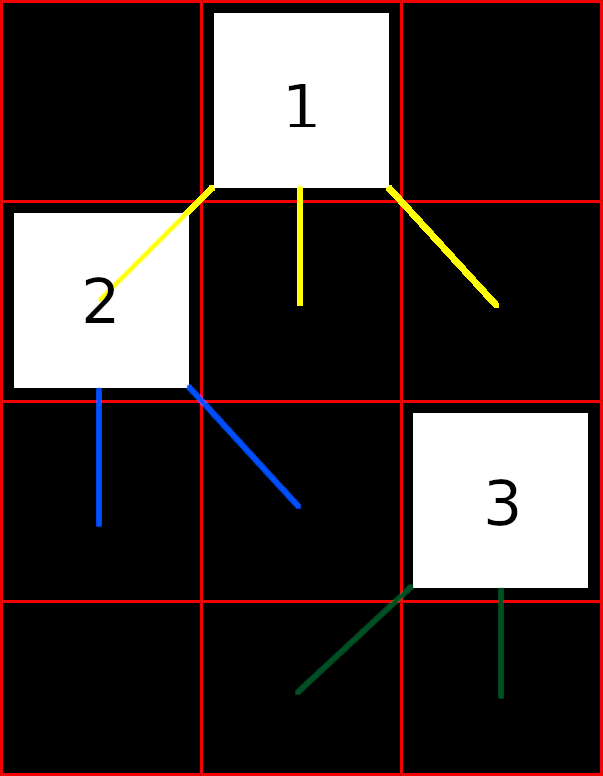

# Studienleistung II: GraphicsApp | Falling Snow

## Allgemeine Hinweise zur Studienleistung
In dieser Studienleistung werden Sie eine Programmieraufgabe lösen.
Diese Programmieraufgaben besteht aus einem Projekt
* ```Studienleistung-II-FallingSnow```

Nutzen Sie zum Lösen der Aufgabe die bereitgestellte Klassendatei als Einstiegspunkt und fügen Sie weitere Klassen nach Bedarf hinzu.
Zum Einreichen Ihrer Aufgabe nutzen Sie die entsprechende Funktion in GRIPS.
Falls Sie Problemen mit dem Starterpaket oder dem Einreichen der Aufgabe haben, können Sie sich in den Handouts auf GRIPS informieren.

Achtung: Eine Verlängerung der Abgabefrist ist nicht möglich.
Einreichungen, die uns (zu spät) per E-Mail erreichen, werden nicht mehr berücksichtigt.
Alle nicht eingereichten Aufgaben werden mit nicht bestanden bewertet.
Testen Sie den Upload am besten schon vor Ablauf der Frist in Ruhe: Sie können bis zum Abgabetermin beliebig viele neue Lösungen einreichen.

Bewertungskriterien: Für die gesamte Studienleistung gilt, dass die eingereichten Lösungen nur die in der Aufgabenstellung beschriebenen Probleme lösen sollen.
Lassen Sie keinen Teil der jeweiligen Aufgabe weg und interpretieren Sie die Fragestellung nicht selbstständig.
Bewertet wird, inwieweit Sie das beschriebene Problem vollständig lösen.
Wenn Sie die Aufgaben erfolgreich bearbeitet haben, können Sie Ihre Lösung gerne kreativ gestalten und erweitern; achten Sie dabei darauf, dass die eigentlichen Anforderungen weiterhin erfüllt bleiben.
Die Qualität Ihres Codes fließt in die Gesamtnote mit ein: Nutzen Sie Decomposition um Ihre Programme übersichtlich zu gestalten.
Verwenden Sie sinnvolle Bezeichner für Variablen und Methoden und kommentieren Sie ausreichend.
Beachten Sie dazu die Kriterien für guten und schlechten Code, die in der Vorlesung erwähnt wurden.

Sollten Sie Fragen haben oder Hilfe brauchen, können Sie im Discord unter der Kategorie Support in den Channel Studienleistung uns eine Nachricht hinterlassen.
Wir stehen Ihnen dann zeitnah zur Seite über eine Direktnachricht.

# Falling Snow

## Ausgangslage
Im Rahmen dieser Aufgabe implementieren Sie eine rudimentäre Simulation für Schneefall in Pixel-Art.


Die Ausgangsbedingung für diese Aufgabe ist wie folgt:

Sie implementieren ausgehend von einer "leeren" *GraphicsApp* die Schneefallsimulation in Pixel-Art.

## Anforderungen
Folgende Anforderungen muss die Schneefallsimulation in Pixel-Art erfüllen:

* Die Klasse `FallingSnowApp` muss als Einstiegspunkt in Ihr Programm verwendet werde, alle andere Logik soll auf sinnvolle Klasse aufgteilt werden
* Die Darstellung des Schneefalls soll in einem Grid aus `x` (z.B. 200) Spalten und Zeilen bestehen, dass Sie selber erstellen, welche abhängig von den Dimensionen des Canvas berechnet werden

```java
CANVAS_WIDTH = 800; 
CANVAS_HEIGHT = CANVAS_WIDTH;
GRID_WIDTH = CANVAS_WIDTH / 4;
GRID_HEIGHT = CANVAS_HEIGHT / 4;
```

* Die Farbe einer Schneeflocke wird zufällig als Graustufe, zwischen 100 und 255, gewürfelt.
* Verwenden Sie die Klasse `Rectangle` ([Dokumentation der Klasse Rectangle](https://oop-regensburg.github.io/GraphicsApp-Reborn-Library/html/classde_1_1ur_1_1mi_1_1oop_1_1graphics_1_1_rectangle.html)) für eine Schneeflocke und berechnen Sie Breite, Höhe und Position einer Schneeflocke anhand des Grids.  
* Einmal pro Aufruf der `draw`-Methode kann eine Schneeflocke entweder um -1, 0 oder +1 die Spalte wechseln, wenn diese nach unten fällt (die Zeile nach unten wechselt) und die Spalte in der neuen Zeile noch nicht belegt ist
  
  
  
  * `Schneeflocke 1` kann demnach eine Spalte nach links (-1 Spalte in der neuen Reihe), nach rechts (+1 Spalte in der neuen Reihe) oder gerade (gleiche Spalte in der neuen Reihe) nach unten fallen (gelbe Markierung im Bild)
  * `Schneeflocke 2` liegt am linken Rand der Zeichenfläche (Canvas) und kann demnach nicht nach links fallen und deswegen nur nach rechts (+1 Spalte in der neuen Reihe) oder gerade (gleiche Spalte in der neuen Reihe) nach unten fallen (blaue Markierung im Bild) 
  * `Schneeflocke 3` liegt am rechten Rand der Zeichenfläche (Canvas) und kann demnach nicht nach rechts fallen und deswegen nur nach links (-1 Spalte in der neuen Reihe) oder gerade (gleiche Spalte in der neuen Reihe) nach unten fallen (grüne Markierung im Bild)
* Sobald eine Schneeflocke keine Möglichkeiten mehr hat sich in die nächste Zeile zu bewegen, bleibt diese stehen (alle Möglichen Spalten sind bereits belegt) 
* In der obersten Zeile wird einmal pro Aufruf der `draw`-Methode pro Spalte randomisiert ermittelt (z.B. mit einer Chance 1:80), ob eine Schneeflocke erscheint oder nicht, sofern die Spalte nicht belegt ist
* Wenden Sie das Prinzip `Decomposition` an
* Verwenden Sie sinnvolle Datenstrukturen (z.B. Array oder Array of Arrays)
* Verwenden Sie sinnvolle Klassen

## Hinweise
* Überlegen Sie sich genau welchen Datentyp Sie für Ihre zentrale Grid-Datenstruktur wählen und wann genau ein Feld im Grid nicht schwarz sein darf
* Überlegen Sie sich in welcher Reihenfolge Sie die einzelnen Objekte in Ihrer Simulation updaten wollen
* Zerlegen Sie das in dieser Aufgabe gestellte Problem in sinnvolle Teilprobleme
* Die `draw`-Methode wird immer wieder aufgerufen und funktioniert daher prinzipiell wie ein Loop oder eine Schleife
* Es gibt keine Bedingung damit das Programm endet; Der Canvas ist irgendwann voll
* Empfehlung: Trennen Sie die Darstellung (`View`) ihrer Objekte von deren Daten (`Model`), z.B. mit Klasse `Snowflake` für Daten und `SnowflakeView` für das Zeichnen in der `GraphicsApp`

## Ideen für Erweiterungen
```Wenn Sie die Aufgaben erfolgreich bearbeitet haben, können Sie Ihre Lösung gerne kreativ gestalten und erweitern; achten Sie dabei darauf, dass die eigentlichen Anforderungen weiterhin erfüllt bleiben.```
* Erweiterungen sind komplett optional
* Ideen für Erweiterungen:
  * Laden Sie ein hübsches Hintergrundbild für eine weihnachtlichere Szenerie, in der es schneit
  * Bauen Sie ein kleines Haus ein, auf dessen Dach der Schnee ebenfalls liegen bleibt
  * Integrieren Sie Audio und spielen im Loop einen weihnachtlichen Jingle oder sanften Wind
  * etc.
